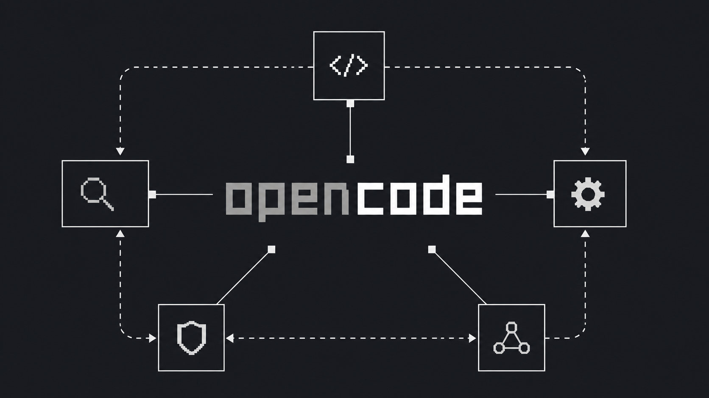

# open-workflows



OpenCode plugin for planner/worker/reviewer agent swarms with bounded loops. Same shape as Anthropic's dynamic workflows in Claude Code, but built on OpenCode's plugin + SDK surface so it works with any model provider and runs in your existing OpenCode setup.

You describe a goal; the plugin spins up child agents, runs them in parallel where it's safe, and keeps iterating until a reviewer signs off or the budget runs out.

## Why

Some tasks are too big for a single agent pass: explore unfamiliar code, then edit, then verify. This plugin gives you a coordinated loop instead of one monolithic prompt.

- Read-only research runs in parallel across multiple workers.
- Editing workers always run one at a time, in dependency order.
- A reviewer decides whether to loop again, ship, or stop and ask the user.
- Every child session is a real OpenCode session, so you can navigate to it with `Leader+Down` and inspect what each agent did.

Inspired by Anthropic's [dynamic workflows in Claude Code](https://docs.claude.com/en/docs/claude-code/dynamic-workflows): same planner/worker/reviewer shape, ported onto OpenCode so it works with any model and any project you point OpenCode at.

## Install

### From npm

```sh
npm install -g open-workflows
```

Add it to your OpenCode config (don't remove your other settings):

`~/.config/opencode/opencode.jsonc`

```jsonc
{
  "$schema": "https://opencode.ai/config.json",
  "plugin": ["open-workflows"]
}
```

Restart OpenCode.

### From a local clone

```sh
git clone https://github.com/AndrxwWxng/open-workflows
cd open-workflows
npm install
npm run build
```

Point the plugin loader at the local build:

```jsonc
{
  "plugin": ["file:///absolute/path/to/open-workflows/dist/index.js"]
}
```

Restart OpenCode after each rebuild.

### Optional agents and command

The package ships a `workflow-planner`, `workflow-worker`, and `workflow-reviewer` agent definition, plus a `/workflow` command shortcut.

Install the agents globally:

```sh
mkdir -p ~/.config/opencode/agents
cp agents/*.md ~/.config/opencode/agents/
```

Install the command globally:

```sh
mkdir -p ~/.config/opencode/commands
cp commands/*.md ~/.config/opencode/commands/
```

Or per-project into `.opencode/agents/` and `.opencode/commands/`. Then reference them by name from the plugin config or the `dynamic_workflow` tool arguments.

## Configuration

Three layers, in increasing priority:

1. **Built-in defaults** — see the table below.
2. **Plugin config** — a tuple alongside the package name. Sets your personal baseline for every workflow run.
3. **Tool arguments** — passed to `dynamic_workflow` per call. Override the config for that one run.

```jsonc
{
  "plugin": [
    ["open-workflows", {
      "plannerAgent": "workflow-planner",
      "workerAgent": "workflow-worker",
      "reviewerAgent": "workflow-reviewer",
      "maxRounds": 3,
      "maxWorkers": 3,
      "maxTasks": 20,
      "allowEdits": false,
      "parallelWorkers": true
    }]
  ]
}
```

Precedence example: with the config above, calling

```text
Use dynamic_workflow with mode implement, allowEdits true, and maxRounds 5 to add password reset.
```

runs with `mode=implement`, `allowEdits=true`, `maxRounds=5`, and every other setting inherited from the config.

Per-project overrides work too — drop a `.opencode/opencode.jsonc` with its own `plugin:` tuple into the project root, and OpenCode merges it on top of the global config.

| Option | Default | Meaning |
| --- | --- | --- |
| `plannerAgent` | `plan` | Agent that decomposes the goal into tasks. |
| `workerAgent` | `general` | Default agent for workers. |
| `reviewerAgent` | `general` | Agent that decides pass / iterate / blocked. |
| `maxRounds` | `3` | Maximum planner→reviewer iterations. |
| `maxWorkers` | `3` | Workers per round (split between research and edit). |
| `maxTasks` | `20` | Tasks accepted from the planner per round. |
| `allowEdits` | `false` | Allow workers to modify files. Off by default. |
| `parallelWorkers` | `true` | Run read-only workers concurrently. Edits stay serial. |

## Usage

### As a tool

Ask for it by name, or the model picks it up when the goal is multi-step:

```text
Use dynamic_workflow to audit the auth flow in this repo. Mode research, maxRounds 2.
```

For an implementation loop:

```text
Use dynamic_workflow with mode implement and allowEdits true to add password reset.
Run the test suite as the last worker task. Do not commit or push.
```

Tool arguments:

- `goal` (required): the objective.
- `mode`: `research`, `implement`, or `review`. Defaults to `research`.
- `allowEdits`: set `true` for implementation work.
- `maxRounds`, `maxWorkers`, `maxTasks`: same as the config options, per-call.
- `parallelWorkers`: turn off to force sequential workers.
- `successCriteria`: list of strings the reviewer checks against.
- `plannerAgent`, `workerAgent`, `reviewerAgent`: override the configured defaults.
- `model`: optional `provider/model-id` (e.g. `anthropic/claude-sonnet-4-5`).

### As a command

If you copied `commands/workflow.md` into your commands directory, you can trigger a workflow from the prompt with:

```text
/workflow audit the auth flow in this repo
/workflow implement password reset, allowEdits, run tests at the end
```

The command invokes `dynamic_workflow` with sensible defaults and the rest of your text as the goal.

## How a round runs

1. The planner produces a small set of tasks with kinds, dependencies, and acceptance criteria.
2. Workers run in parallel when they have no dependencies and aren't editing. Edit tasks always run one at a time in declaration order.
3. The reviewer reads the worker reports, marks each success criterion met or missed, and replies with `pass`, `needs-attention`, or `blocked`.
4. On `needs-attention` the workflow starts a new round. On `pass` it stops. On `blocked` it stops and returns the reason.

Child sessions stay attached to the parent, so the TUI's session tree shows the swarm.

## Safety

- Editing is disabled by default. Enable it explicitly with `allowEdits: true`.
- Parallel editing is never on; editing workers are always serial.
- Worker prompts tell agents not to commit, push, reset, or delete unrelated files.
- The reviewer and worker prompts deny the `task` tool, so child agents cannot spawn additional subagents.
- Round, worker, and task counts are hard-capped so a runaway planner cannot exhaust your budget.

## Development

```sh
npm install
npm run typecheck
npm test
npm run lint
npm run build
```

The package exports an ESM plugin from `dist/index.js`. OpenCode's npm plugin loader installs it into `~/.cache/opencode/node_modules/` automatically.

## License

MIT